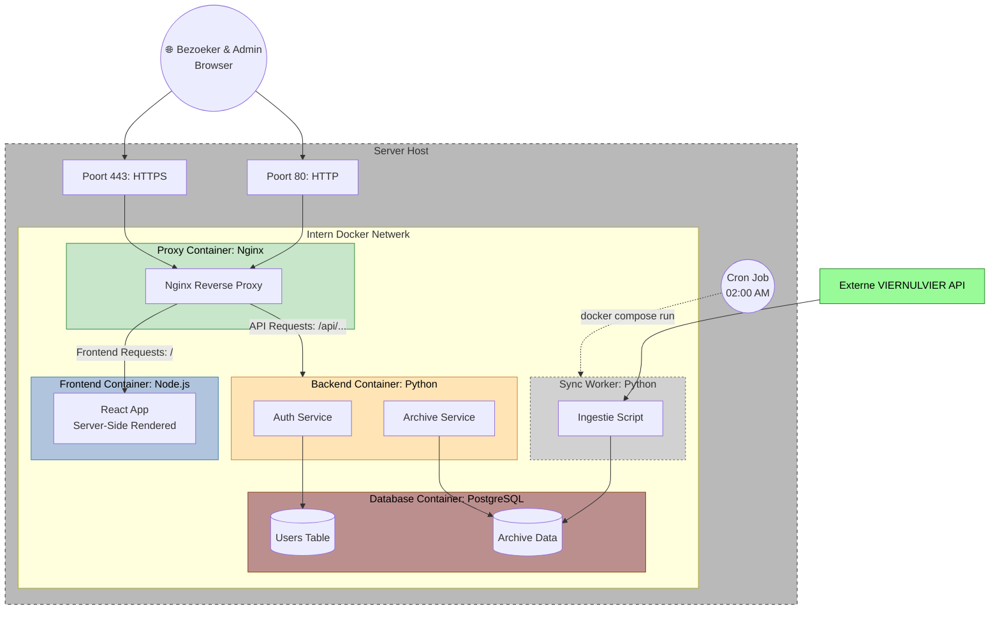

# Architectuur Documentatie: VIERNULVIER Archief

> **STATUS: DRAFT**
> Dit document is momenteel een werkversie. Beslissingen over de exacte implementatie moeten nog worden gefinaliseerd.

Dit document beschrijft de technische opbouw, de interactie tussen componenten en de veiligheidsstrategie van het systeem.

## 1. Systeem Overzicht

Het systeem is opgebouwd volgens een **Four-Tier Architecture**, gecontaineriseerd met Docker (zie [ADR-001](adr/001-docker.md) en [ADR-002](adr/002-four-container-architecture.md)). De architectuur is ontworpen om robuustheid en gegevensintegriteit te garanderen, met een strikte scheiding tussen publieke interface en administratieve achtergrondtaken.

## 2. Infrastructuur & Componenten

Het systeem is verdeeld in vijf logische componenten die draaien binnen een afgeschermd virtueel Docker-netwerk op de host-server.

### 2.1 Proxy Container (Toegangspoort)

De enige container die direct verbonden is met de buitenwereld (Poort 80/443), gebouwd met **Nginx**.

- **Reverse Proxy:** Routeert inkomend verkeer naar de juiste interne container.
- **SSL-terminatie:** Handelt HTTPS af en forceert versleutelde verbindingen via een 301-redirect.
- **Routing:** Stuurt `/api/*` verzoeken door naar de backend-container en alle overige verzoeken naar de frontend-container, via het interne Docker-netwerk.

### 2.2 Frontend Container (Gebruikersinterface)

Serveert de React-applicatie, gebouwd met **Node.js 20**.

- **React Router:** Maakt gebruik van server-side rendering via React Router voor snelle paginaweergave.
- **Intern:** Luistert op poort 3000, enkel bereikbaar via de proxy-container.
- **Build:** Gebruikt een multi-stage Docker build voor een geoptimaliseerde productie-image.

### 2.3 Backend Container (API & Business Logic)

De logische kern van de applicatie, gebouwd met **Python 3.14.3 en FastAPI**.

- **Shared Logic Layer:** Bevat de centrale business rules en database-modellen die gedeeld worden met de Sync Worker.
- **Stateless API:** Maakt gebruik van JWT-tokens voor authenticatie en Pydantic voor strikte data-validatie.
- **Services:** Intern verdeeld in een `Auth Service` en een `Archive Service`.

### 2.4 Sync Worker (Nightly Data Ingestie)

Een kortstondige (**ephemeral**) container die dezelfde base-image gebruikt als de backend.

- **Automatisering:** Wordt elke nacht om 02:00 aangeroepen via de host-system **Cron**.
- **Functie:** Haalt autonoom data op uit de externe VIERNULVIER API en synchroniseert deze met de lokale database.
- **Isolatie:** Draait als een apart proces om de publieke API niet te belasten.

### 2.5 Database Container (Opslag)

Een **PostgreSQL 15** database die volledig is geïsoleerd van het internet.

- **Toegang:** Alleen bereikbaar voor de `backend` en `sync-worker` containers.
- **Persistentie:** Maakt gebruik van named Docker volumes voor data-behoud bij updates.

## 3. Data Flow & Integriteit

### 3.1 Gebruikersinteractie (Read/Write)

Wanneer een gebruiker of admin een actie uitvoert:

1. **Request:** Browser stuurt een HTTPS/JSON verzoek.
2. **Proxy:** Nginx routeert het verzoek naar de frontend- of backend-container op basis van het URL-pad.
3. **Processing:** De backend valideert het verzoek en voert SQL-queries uit.
4. **Response:** Data wordt als JSON teruggestuurd naar de frontend.

### 3.2 Nachtelijke Synchronisatie & Transacties

Om de betrouwbaarheid van het archief te garanderen, volgt de Sync Worker een strikt protocol:

1. **Fetch:** Data wordt opgehaald bij de externe bron.
2. **Atomic Transaction:** De worker opent één enkele **SQL-transactie** voor de gehele update-cyclus.
3. **Commit/Rollback:** Pas als alle data succesvol is verwerkt, wordt de `COMMIT` uitgevoerd. Bij een netwerkfout of crash vindt een automatische `ROLLBACK` plaats, waardoor de database nooit in een inconsistente staat verkeert.

## 4. Beveiliging & Persistentie

### 4.1 Transport & Authenticatie

- **TLS:** Al het inkomende verkeer is versleuteld.
- **JWT:** Authenticatie voor admin-functies gebeurt via stateless JSON Web Tokens in de HTTP-headers.

### 4.2 Data Persistentie

- `db_data`: Volume voor de PostgreSQL data-directory.
- `media_storage`: Volume voor fysieke archiefstukken (scans, afbeeldingen).

## 5. Ontwerpbeslissingen

Gedetailleerde argumentatie voor specifieke keuzes (zoals de keuze voor een directe DB-verbinding voor de worker boven een API-tussenlaag) is vastgelegd in de **Architecture Decision Records (ADRs)** in `/docs/adr/`.
