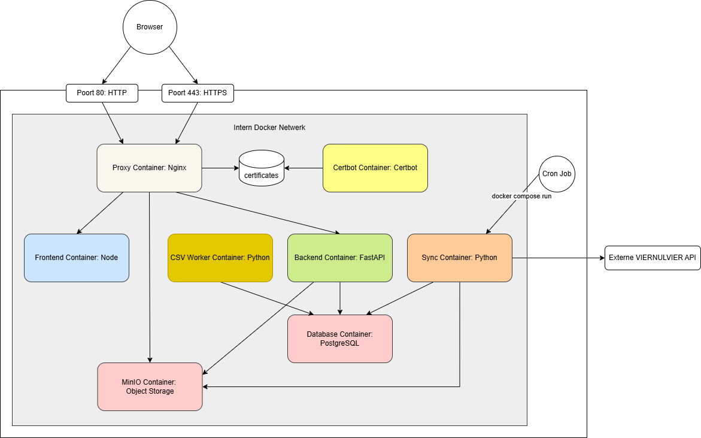

# Architectuur Documentatie: VIERNULVIER Archief

Dit document beschrijft de huidige high-level architectuur van het
VIERNULVIER-archief op basis van de actuele codebase, Compose-configuratie en
runtime-instellingen.

## 1. Systeemoverzicht

De applicatie draait als een gecontaineriseerde webstack met een scheiding
tussen publieke HTTP-verwerking, server-side frontend-rendering,
backendbusinesslogica, relationele opslag, object storage en achtergrondtaken.

- De lokale basisstack bestaat uit vijf langlevende services: `proxy`,
  `frontend`, `backend`, `database` en `minio`.
- Twee extra procesrollen delen de backend-image maar draaien alleen op vraag:
  `sync_worker` via het `sync`-profiel en `csv_worker` via het `csv`-profiel.
- In productie voegt `docker-compose.prod.yml` een extra `certbot`-service toe,
  activeert het TLS via een aparte Nginx-configuratie en zet restartbeleid op
  de langlevende services.
- `docker-compose.ci.yml` is bewust standalone gehouden zodat CI geen lokale
  poortbindingen of persistente volumes erft.

De oorspronkelijke containeropzet is historisch vastgelegd in
[ADR-001](adr/001-docker.md) en [ADR-002](adr/002-four-container-architecture.md),
maar de huidige implementatie is intussen uitgebreid met object storage en een
extra importworker. Die actuele uitbreiding is vastgelegd in
[ADR-014](adr/014-expanded-service-topology-and-object-storage.md).

## 2. Runtime-topologie

### 2.1 Netwerkgrenzen

- De `proxy`-container publiceert in de basisstack poort `80`; in combinatie
  met de productie-override publiceert dezelfde container ook poort `443`.
- `frontend` en `backend` gebruiken enkel `expose` en blijven dus intern
  bereikbaar op respectievelijk poort `3000` en `8000`.
- `database` heeft geen publieke poortbinding en is alleen bereikbaar binnen
  het Docker-netwerk.
- `minio` publiceert in de huidige lokale stack wel poorten `9000` en `9001`
  naar de host voor de S3-API en de beheersconsole.
- `backend` wacht op een gezonde `database` en `minio` voordat de API start.
- `sync_worker` en `csv_worker` wachten op een gezonde `database` maar draaien
  niet standaard mee met `docker compose up`.

## 3. Componenten

### 3.1 Proxy

De proxy gebruikt **Nginx** als primaire publieke toegangspoort voor browser- en
API-verkeer.

In de basisstack:

- Nginx luistert op poort `80`.
- Verkeer naar `/api/` wordt doorgestuurd naar `backend:8000`.
- Alle andere frontendrequests worden doorgestuurd naar `frontend:3000`.
- Leestoegang tot publieke media op `/media/` wordt doorgestuurd naar
  `minio:9000/media/`.
- Die `/media/`-route verwijdert `Authorization`-headers, staat enkel `GET` en
  `HEAD` toe en zet agressieve cacheheaders voor immutable media.
- Op `/api/` staat `client_max_body_size 50M` ingesteld zodat uploads groter
  dan het Nginx-default niet meteen stranden.

In productie wordt dezelfde proxy uitgebreid met TLS-terminatie:

- HTTP op poort `80` dient voor redirects naar HTTPS en voor ACME-challenges.
- HTTPS op poort `443` gebruikt Let's Encrypt-certificaten uit gedeelde
  volumes.
- Een shell-loop voert periodiek `nginx -s reload` uit zodat vernieuwde
  certificaten opgepikt worden zonder volledige stack-restart.
- De huidige productieconfiguratie proxyt enkel `/` en `/api/`; er is vandaag
  geen aparte `/media/`-route in `nginx.prod.conf`, waardoor publieke media in
  productie niet via exact dezelfde Nginx-flow lopen als lokaal.

De productie-aanpak rond TLS en certificaatbeheer is vastgelegd in
[ADR-013](adr/013-nginx-tls-certbot.md).

### 3.2 Frontend

De frontend draait als een aparte **Node.js 24 alpine** container met een
multi-stage Dockerfile.

- De build gebruikt **React Router 7** in SSR-modus (`ssr: true`).
- De runtime start via `react-router-serve ./build/server/index.js` en luistert
  intern op poort `3000`.
- De UI-stack combineert **React 19**, **MUI 7**, **Tailwind CSS 4** en
  **i18next**.
- De router bevat een taalprefix op `/:lang` met pagina's voor onder meer
  home, archive, history, login en users.
- De frontend maakt API-calls via Axios-clients die gebouwd zijn tegen
  `VITE_API_BASE_URL`.

De keuze voor het React-framework en de componentbibliotheek is historisch
uitgewerkt in [ADR-005](adr/005-react-frontend.md) en
[ADR-006](adr/006-mui-frontend.md).

### 3.3 Backend API

De backend draait op **Python 3.14.3**, **FastAPI** en **Uvicorn**.

De keuze voor FastAPI als backendframework en Uvicorn als ASGI-server is
gemotiveerd in [ADR-004](adr/004-fastapi-backend.md) en
[ADR-007](adr/007-uvicorn-asgi-server.md).

- De FastAPI-app gebruikt `root_path="/api"` en hangt alle publieke routes
  onder `/api/v1`.
- De router is opgesplitst in drie hoofddomeinen: `status`, `auth` en
  `archive`.
- `status` bevat de healthcheck voor API en databankconnectie.
- `auth` bevat login, token refresh, profielopvraging en beheer van users,
  roles en permissions.
- `archive` bevat CRUD- en lijstendpoints voor producties, events, halls, tags,
  statistieken en productiegebonden media.

De backend-container voert bij elke start eerst `python init_db.py` uit en pas
daarna `uvicorn src.main:app`.

Die initfase doet meer dan enkel tabellen aanmaken:

- **Schema-sync:** `Base.metadata.create_all(...)` maakt ontbrekende tabellen
  aan.
- **Seeding:** permissies, de `admin`-rol, een standaard admingebruiker en de
  initiële `sync_state`-records worden idempotent aangemaakt.
- **MinIO-initialisatie:** tijdens de FastAPI-lifespan wordt de bucket
  `media` aangemaakt indien nodig en krijgt die een publieke read-policy voor
  objecten.

De backend is opgezet als een stateless API: requests gebruiken een korte
SQLAlchemy-sessie via dependency injection en beveiligde endpoints vertrouwen op
Bearer-tokens in plaats van server-side sessiestatus.

### 3.4 Authenticatie en autorisatie

De authenticatielaag is JWT-gebaseerd en permissiegedreven.

- `POST /api/v1/auth/login` valideert gebruikersnaam en wachtwoord en levert
  een access token en refresh token op.
- `POST /api/v1/auth/refresh` levert op basis van een geldig refresh token een
  nieuw access token op.
- Het access token bevat `sub`, `roles`, `permissions`, `token_version` en een
  expliciet `type="access"`.
- Het refresh token bevat `sub`, `token_version` en `type="refresh"`.
- Beschermde endpoints gebruiken `HTTPBearer`, decoderen het token en laden de
  actuele gebruiker daarna opnieuw uit de databank.
- Tokens worden extra gevalideerd op `token_version`, zodat oude tokens
  ongeldig worden wanneer een gebruiker gerevoceerd of opnieuw uitgegeven wordt.
- Autorisatie gebeurt via `RequirePermissions(...)`; `super_user`-accounts
  krijgen daar een expliciete bypass op.

De frontend bewaart access- en refresh tokens momenteel in `localStorage` en
probeert bij een `401` automatisch een access token te vernieuwen voor niet-
auth endpoints.

Dit levert in de praktijk een RBAC-opzet op met deze lagen:

1. `users`
2. `roles`
3. `permissions`
4. koppelrelaties `user_roles` en `role_permissions`

De keuze voor deze JWT- en RBAC-opzet is vastgelegd in
[ADR-012](adr/012-jwt-rbac-authentication.md).

### 3.5 Database

De databank draait in een aparte **PostgreSQL 15 alpine** container.

De keuze voor PostgreSQL als relationele databank is gemotiveerd in
[ADR-003](adr/003-postgresql-database.md).

- Persistentie gebeurt via het named volume `postgres_data`.
- SQLAlchemy beheert het datamodel, de engine en de sessies.
- Alle modellen delen dezelfde declarative `Base`.
- Requests gebruiken een korte SQLAlchemy-sessie via `Depends(get_db)`.

De databank bevat niet alleen archiefdata en authenticatiegegevens, maar ook
de `sync_state`-records en metadata van geuploade media. De binaire
mediabestanden zelf leven niet in PostgreSQL maar in MinIO.

De keuze voor SQLAlchemy en de PostgreSQL-driver is uitgewerkt in
[ADR-008](adr/008-sqlalchemy-orm.md) en
[ADR-009](adr/009-psycopg2-binary-adapter.md).

### 3.6 Object storage

MinIO is een aparte **S3-compatibele object storage** voor mediabestanden.

- De service draait als `minio/minio` met een console op poort `9001`.
- Objecten worden opgeslagen in de bucket `media`.
- De backend gebruikt MinIO zowel bij opstart als tijdens media-uploads en
  deletions.
- Bij uploads wordt enkel metadata in de `media`-tabel opgeslagen; de bytes
  zelf worden in object storage geplaatst.
- In de lokale stack serveert Nginx publieke reads rechtstreeks van MinIO via
  `/media/<object_key>`.

Deze laag maakt het mogelijk om relationele metadata en binaire objectopslag
apart te schalen en te beheren. De keuze om de basisstack hiervoor uit te
breiden is vastgelegd in
[ADR-014](adr/014-expanded-service-topology-and-object-storage.md).

### 3.7 Sync worker

De sync worker is een aparte procesrol boven op dezelfde Docker-image als de
backend.

- De service gebruikt `python -m src.worker.sync_job` als command.
- Ze draait niet standaard mee met `docker compose up`, maar alleen via het
  `sync`-profiel of via een expliciete `docker compose run`.
- De worker gebruikt dezelfde configuratie, modellen en databanklaag als de
  backend.
- De synchronisatie gebeurt in een vaste volgorde: genres, productions, events
  en event prices.
- De worker gebruikt een wrapper rond de externe VIERNULVIER-API en verwerkt de
  voortgang via `sync_state`.

De scheiding tussen publieke API en achtergrondsync is historisch vastgelegd in
[ADR-010](adr/010-up-to-date-database.md).

### 3.8 CSV worker

Naast de sync worker bestaat er ook een aparte CSV-importworker.

- De service gebruikt `python -m src.worker.csv_parser` als command.
- Ze draait alleen via het `csv`-profiel.
- De worker leest lokale CSV-bestanden en zet die om naar production-, event-,
  hall- en tagrecords in dezelfde databank.
- In de praktijk voer je deze worker best pas uit nadat de sync worker al een
  initiële lading data in de databank heeft geplaatst, omdat de CSV-import voor
  halls en tags eerst controleert of die records al bestaan. De sync worker
  ondersteunt voorlopig zelf nog geen halls, waardoor die referentiedata waar
  nodig nog apart voorbereid moet worden.
- Dit is een eenmalige of ad-hoc importtool, geen langlevende runtime-service.

### 3.9 Certbot in productie

De productie-override voegt een aparte `certbot`-container toe.

- `certbot-www` wordt gebruikt voor ACME-validatiechallenges.
- `certbot-certs` bevat de uitgegeven certificaten.
- Certbot draait in een lus met `certbot renew` zodat certificaatvernieuwing
  geautomatiseerd is.

## 4. Belangrijkste datastromen

### 4.1 Browserverkeer

1. Een browser stuurt een request naar de host op poort `80` of `443`.
2. Nginx beslist op basis van padrouting of het request naar frontend,
   backend of, in de lokale stack, publieke mediaopslag gaat.
3. De frontend levert SSR-responses en client-side navigatie voor de
   gebruikerspagina's.
4. De backend verwerkt API-calls, raadpleegt PostgreSQL en indien nodig MinIO,
   en geeft JSON terug.

De standaarddeployment is dus bedoeld als same-origin setup achter Nginx,
hoewel de frontend technisch wel een expliciete `VITE_API_BASE_URL` gebruikt.

### 4.2 Authenticatieflow

1. Een gebruiker meldt zich aan via `POST /api/v1/auth/login`.
2. De backend verifieert het wachtwoord tegen de gehashte waarde in de
   `users`-tabel.
3. Bij succes worden JWT-tokens uitgegeven.
4. De frontend bewaart die tokens in `localStorage`.
5. Bij volgende requests wordt het access token meegestuurd als Bearer-token.
6. Bij een verlopen access token probeert de frontend eerst een refreshflow.
7. De backend decodeert het token, haalt de gebruiker opnieuw op uit de
   databank en controleert daarna de vereiste permissies.

Door de gebruiker opnieuw uit de databank te laden en `token_version` te
controleren, blijft autorisatie gekoppeld aan de actuele gebruikersstatus en
niet enkel aan oude tokenclaims.

### 4.3 Opstartflow van de backend

1. Docker start `database` en `minio`.
2. Zodra de healthchecks slagen, mag `backend` opstarten.
3. `init_db.py` maakt tabellen aan en seedt basisdata.
4. Daarna start Uvicorn de FastAPI-app.
5. Tijdens de FastAPI-lifespan wordt de MinIO-bucket gecontroleerd en indien
   nodig aangemaakt of gepoliced.

Dit zorgt ervoor dat een nieuwe omgeving zonder handmatige bootstrap zowel een
bruikbare auth-configuratie als een werkende mediabucket krijgt.

### 4.4 Mediaflow

1. Een geauthenticeerde gebruiker uploadt een bestand via
   `POST /api/v1/archive/productions/{production_id}/media/`.
2. De backend valideert het MIME-type en bewaart het object in MinIO.
3. Daarna wordt metadata over dat object in PostgreSQL opgeslagen.
4. De API antwoordt met een publiek leesbare URL op dezelfde host.
5. In de lokale stack loopt een latere `GET /media/...` via Nginx rechtstreeks
   naar MinIO.

De codebase ondersteunt dus een duidelijke splitsing tussen metadata in de
relationele databank en binaire media in object storage.

### 4.5 Synchronisatie- en importflow

1. Een beheerder of host-cron start `sync_worker` expliciet.
2. De worker gebruikt de API-key uit `.env` om de externe VIERNULVIER-API aan
   te spreken.
3. Fetchers halen pagineerbare datasets op en verwerken die in een vaste
   volgorde.
4. De voortgang wordt vastgehouden via `sync_state`.
5. Los daarvan kan een operator `csv_worker` starten om historische CSV-data in
   dezelfde databank te importeren.

Beide workers zijn architecturaal gescheiden van het publieke HTTP-pad zodat
achtergrondverwerking geen impact hoeft te hebben op de responstijd van de API.

## 5. Beveiliging

### 5.1 Transportbeveiliging

- Lokaal draait de stack standaard over HTTP op poort `80`.
- In productie wordt poort `80` gereduceerd tot redirect- en ACME-verkeer.
- Normaal gebruikersverkeer hoort in productie over HTTPS op poort `443` te
  lopen.
- De lokale compose publiceert daarnaast ook MinIO-poorten `9000` en `9001`
  rechtstreeks naar de host voor beheerdoeleinden.

### 5.2 Applicatiebeveiliging

- Authenticatie gebruikt JWT access en refresh tokens.
- Wachtwoorden worden gehasht opgeslagen, nooit in plaintext.
- Autorisatie is permissiegedreven, met een expliciete `super_user`-bypass.
- Tokenversies maken server-side invalidatie van bestaande tokens mogelijk.
- De databank is niet rechtstreeks publiek bereikbaar.
- Geheimen zoals database-credentials, de JWT-secret, de externe API-key en de
  MinIO-credentials worden centraal via `.env` aangeleverd.
- CORS-middleware staat momenteel uit; de primaire deploymentaanname is daarom
  same-origin verkeer achter de proxy of een compatibel ingestelde
  `VITE_API_BASE_URL`.
- De Nginx-route voor publieke media verwijdert `Authorization`-headers en
  beperkt requests tot `GET` en `HEAD`.

## 6. Persistentie en deploymentvarianten

### 6.1 Persistente volumes

- `postgres_data`: PostgreSQL-data en de bron van waarheid voor relationele
  archief-, auth- en syncgegevens.
- `minio_data`: persistente object storage voor geüploade mediabestanden.
- `certbot-www`: webroot voor ACME-validatiechallenges in productie.
- `certbot-certs`: Let's Encrypt-certificaten in productie.

### 6.2 Compose-varianten

- `docker-compose.yml`: lokale of generieke basisstack met proxy, frontend,
  backend, PostgreSQL, MinIO en optionele workerprofielen.
- `docker-compose.prod.yml`: productie-override voor TLS, Certbot en
  restartbeleid.
- `docker-compose.ci.yml`: aparte CI-stack zonder hostpoortbindingen en zonder
  persistente database- of MinIO-volumes.

## 7. Kwaliteitsborging

De betrouwbaarheid van de applicatie wordt bewaakt door tests op meerdere
niveaus.

- De backend gebruikt **Pytest** voor unit- en integratietesten.
- De frontend gebruikt **Vitest** voor unit tests en daarnaast ESLint en
  TypeScript-controles.
- De CI-composeconfiguratie zet daarvoor een geïsoleerde stack op met een
  tijdelijke PostgreSQL- en MinIO-omgeving.

De backendteststrategie en de keuze voor Pytest zijn historisch vastgelegd in
[ADR-011](adr/011-pytest-backend-test.md).

## 8. ADRs

De detailmotivatie voor grotere ontwerpbeslissingen staat in `docs/adr/`.
Dit document beschrijft vooral de actuele implementatie zoals die vandaag in de
code staat; de ADRs documenteren de onderliggende of historische beslissingen
waaruit die architectuur gegroeid is.