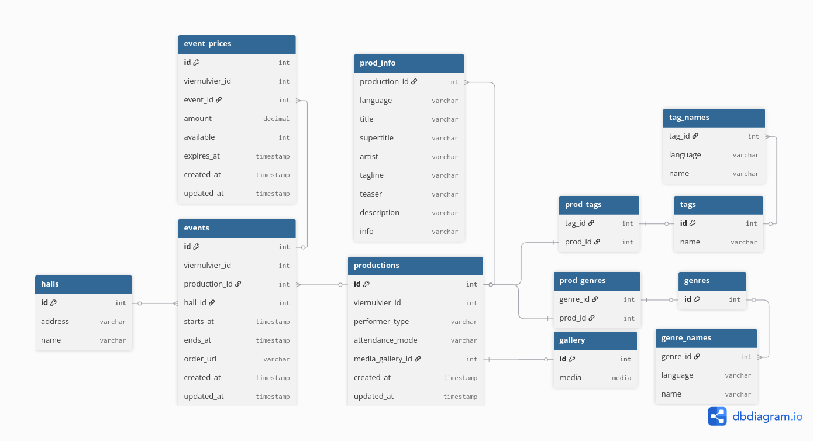

# Domeinmodel (ERD)



<details>
<summary>Click to see DBML</summary>

```
Table productions {
    id int [pk] // production unique ID
    viernulvier_id int [unique]

    performer_type varchar // e.g., "group", "individual"
    attendance_mode varchar // e.g., "offline", "online", "hybrid"

    media_gallery_id int [ref: - gallery.id]

    created_at timestamp
    updated_at timestamp
}

Table prod_info {
  production_id int [ref: > productions.id]
  language varchar

  title varchar
  supertitle varchar
  artist varchar
  tagline varchar
  teaser varchar
  description varchar
  info varchar
}

Table genres {
  id int [pk]
}

Table genre_names {
  genre_id int [ref: > genres.id]
  language varchar
  name varchar
}

Table tags {
  id int [pk]
  name varchar
}

Table tag_names {
  tag_id int [ref: > tags.id]
  language varchar
  name varchar
}

Table prod_tags {
  tag_id int [ref: - tags.id]
  prod_id int [ref: - productions.id]
}

Table prod_genres {
  genre_id int [ref: - genres.id]
  prod_id int [ref: - productions.id]
}

Table events {
    id int [pk]                     // event ID from "@id"
    viernulvier_id int [unique]

    production_id int [ref: > productions.id]
    hall_id int [ref: > halls.id]

    starts_at timestamp
    ends_at timestamp

    order_url varchar

    created_at timestamp
    updated_at timestamp
}

Table event_prices {
    id int [pk]
    viernulvier_id int [unique]

    event_id int [ref: > events.id]

    amount decimal
    available int
    expires_at timestamp

    created_at timestamp
    updated_at timestamp
}

Table halls {
  id int [pk]
  address varchar
  name varchar

}

Table gallery {
  id int [pk]
  media media
}
```
</details>
